# how to programmatically ingest images

Sometimes you can't have a pull-thru cache or pull directly from cgr.dev ... that's okay!  Here's two paths to programmatically pull, scan, and push images to an internal registry.  

For this use case, the inspection is going to be a simple [cosign](https://www.sigstore.dev/how-it-works) verification and a container vulnerability scan.  This will prove that **we're getting exactly the software we expect to from Chainguard** and that **there are no vulnerabilties in each image** before our internal teams have access to them.  We're also going to **add custom SSL certificates** to our image as we bring it inside, as most large enterprises run an inspection proxy somewhere or otherwise need to append internal certificates.

At a high level, here's what's going on:

```mermaid
flowchart LR
    subgraph corporate network
    A(👩🏻‍💻<br>developer)
    B(📦<br>internal<br>container registry)
    end
    A -->| push new images | B
    B -->| pull base images | A
    subgraph internet
    C(🐙<br>chainguard registry)
    end
    D{🔎 acceptance criteria<br>- CVE scans<br>- SBOM validation<br>- Sigstore validation}
    D -->| pull tokens<br>or<br>OIDC | C
    B --> D
```

There are two demos within this repository on how to accomplish this - a shell script ([ingest.sh](ingest.sh)) and a GitHub Actions [workflow file](actions-ingest.yaml).  For the shell script, it iterates over a list of images in `image-list.txt`.  For the GitHub Actions file, it is declared in the "image" matrix on lines 12-20.  Both will append a custom certificate, in this case `test.crt`, to the internal certificate trust.

> [!IMPORTANT]
> In both cases, 5/6 images will succeed.  The sixth image is an older version of an application that will fail the vulnerability check.
